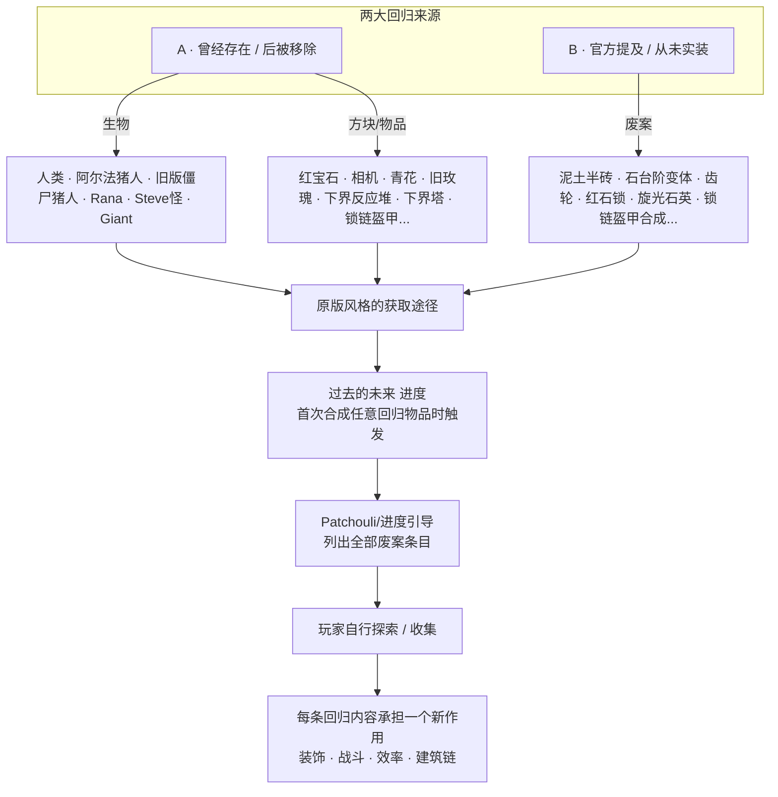

# 过去的未来 · 设计文档（Lost Future）

> 面向 NeoForge 1.21.1 的"考古级"内容回归模组。
>
> **状态**：概念设计稿（v0.1，2026-05-17）
> **范围**：把 Minecraft 各版本中被移除、被替换、或被官方提及却从未真正落地的设计原型，按"原版风格 + 新作用"的方式重新整合回当前生存玩法。
> **目标玩法**：主要面向**单人生存 / 小型服务器**；以"考古解锁感"驱动玩家循序合成、获取与探索。
> **依赖原则**：核心内容零强依赖；与其他模组通过 `#c:` tag 软对接，遇到 ID 冲突时走"标签统一 / 配置去重"。
> **命名空间占位**：`<lf>`（落地时替换为 `lost_future`）。

---

## 0. 一句话定位

让 Minecraft 各版本里**被移除的方块/物品/生物**与**官方提出却从未实装的概念**，以原版美术风格、原版式合成路径，**带着全新但克制的作用**，重新回到生存玩法里——补全"官方明明做过 / 说过，但游戏里却没有"的遗憾感。

---

## 1. 设计目标 / KPI

| 编号 | 目标 | 衡量方式 |
|---|---|---|
| G1 | 满足"考古 / 怀旧 / 收集"心流 | 玩家**在一周目生存内可合成 ≥ 5 种回归物品**（KPI）|
| G2 | 所有回归内容必须"原版感"足够 | 100% 回归物品具备**原版风格的合成 / 获取途径**，且贴图/模型按原版风格出图 |
| G3 | 给每个回归内容**一个新的、克制的作用**（不只是装饰）| 至少 80% 的回归物品**进入至少 1 条生存玩法链路**（建筑、战斗、效率、装饰中之一）|
| G4 | 不破坏原版平衡 | 任何回归物品**不应优于同档原版物品**（同档对比表见 §8），且**不引入新的爆发性资源源**|
| G5 | 可作为引导式百科 | "过去的未来"进度树覆盖**首发 ≥ 20 个废案条目**，玩家通过进度面板即可看到全清单 |

---

## 2. 概念全景



---

## 3. 回归条目总览（首发 23 条）

按"曾被移除"和"提及未实装"两类组织。每条都标注：**来源版本 / 原貌 / 本模组中的新作用 / 平衡权重**。

### 3.1 曾被移除（A 类）

> **参考**列指向 minecraft.wiki 等开源资料；§12 给出完整引用清单。

| ID | 名称 | 来源版本 | 原貌简述 | 本模组中的新作用 | 平衡权重 | 参考 |
|---|---|---|---|---|---|---|
| `<lf>:human` | 人类 | Pre-Classic rd-132328 → Survival Test 移除 | 持武器追击玩家的类玩家敌人；Beta 1.6.6 后无法生成 | 罕见暮色 mob，掉落"破旧布片"，用于补全锁链盔甲（见 §4.3）；不掉落经验，不掉装备 | 不优于流浪者 | [wiki/Human][r-human] |
| `<lf>:alpha_pigman` | 阿尔法猪人（粉皮） | Indev / Halloween Update 前期 | Notch 建模错误产物的"猪头玩家"；后演化为僵尸猪人 | 下界**罕见友好** NPC，可用熟猪肉换"古旧地图碎片"，引导至 §4.4 下界塔 | 不掉落实质装备 | [wiki/Pigman][r-pigman] |
| `<lf>:legacy_zombie_pigman` | 旧版僵尸猪人 | 1.0–1.15 → 1.16 替换为 piglin | 中立、群体复仇 | 受击复仇半径恢复**仅限本模组维度 / 结构内**生效；主世界与下界保持当前版本 piglin 行为不变 | 与现版 piglin 互不替换 | [wiki/Zombified_Piglin][r-zpig] |
| `<lf>:rana` | Rana | Indev MD3 阶段（Dock 离开后移除） | 玩家测试用 mob，绿头巾僧人 | 极罕见村民变种，**只接受附魔书与音乐唱片**交易，给"被遗忘的菜谱" | 单存档限刷 1 次 | [wiki/Rana][r-rana] |
| `<lf>:steve_monster` | Steve 怪 | Indev MD3 阶段 | 主玩家模型的敌对版本 | 仅在"过去的未来"完成度 ≥ 50% 后**作为成就 boss 出现一次**；掉落 §4.7 收集相册 | 一次性 boss | [wiki/Steve_(mob)][r-stevemob] |
| `<lf>:giant` | Giant 巨型僵尸 | Classic / Indev（无 AI 残留至今） | 巨型僵尸，Notch "太 OP"未启用 | 给现有 `minecraft:giant` 注入 AI + 罕见结构刷怪，掉落"远古牙骨" | 走结构刷新，不入野外随机 | [wiki/Giant][r-giant] |
| `<lf>:ruby` | 红宝石 | Java 12w21a 快照 → 12w21b 被绿宝石替换 | 山民交易货币原型，items.png 中残留贴图 | 与绿宝石**平行**的"古商人货币"，仅 §3.3 的废弃哨塔商人接受；可合成回归首饰链 | 不可与绿宝石互转 | [wiki/Ruby][r-ruby] |
| `<lf>:camera` | 相机 | Indev（截图存档功能） | 按下拍照保存 PNG 到 screenshots | **拍照成画**：拍下任意视角，烧制成可挂的"老照片"画作；冷却 60 秒，作品占用画框槽 | 不掉落资源 | [wiki/Camera][r-camera] |
| `<lf>:blue_china_pot` | 青花瓷器 | Halloween 2010 / 早期愚人节素材 | 装饰陶瓷 | 装饰罐头（可挂染料），**蓄水**版本可作为高级花盆替代品（同尺寸普通花盆 1:1） | 仅装饰 + 容器作用 | [wiki/Unused_features][r-unused] |
| `<lf>:legacy_rose` | 旧版玫瑰 | Beta–1.6 → 1.7.2 (13w36a) 被替换为罂粟 | Java 红色花，染深红 | 与罂粟**贴图同价**，但可染**深红**而不是红；用于复古建筑党 | 等价染料 | [wiki/Poppy][r-poppy] · [wiki/Rose render history][r-rose-render] |
| `<lf>:nether_reactor_core` | 下界反应堆核心 | 基岩传统版 0.5 → alpha v0.12.1 移除 | 主世界搭建 3×3×3 框架后触发"下界事件" | 见 §4.4，按基岩老逻辑还原结构激活 → 生成临时"下界塔" | 单存档冷却 30 游戏日 | [wiki/Nether_Reactor_Core][r-reactor-core] |
| `<lf>:nether_tower` | 下界塔（Nether Spire） | 基岩传统版 | 反应堆触发的临时塔，落下原本稀有的物品 | 临时挑战结构，掉落"过去的未来"专属奖励（青铜剑、远古磁石）| 区块时限 + 结构限刷 | [wiki/Nether_Reactor][r-reactor] |
| `<lf>:chainmail_ingot_legacy` | 锁链段 | Beta 时代缺合成 | 锁链盔甲长期无生存合成 | 通过"破旧布片 + 铁锭"在锻造台合成（见 §4.3）；用于补全锁链盔甲合成链 | 不优于铁甲 | [wiki/Chainmail_Armor][r-chain] |
| `<lf>:cyan_rose_old` | 蓝色玫瑰（Classic 染料花） | Classic | 早期染料花 | 与矢车菊**贴图同价**的复古版本 | 等价染料 | [wiki/Cyan_Rose][r-cyanrose] |
| `<lf>:legacy_lava_floor` | 沉浸式岩浆纹 | Alpha 早期 | 旧岩浆贴图 | 通过"远古拓印板"右键岩浆方块切换贴图（个人客户端层；多人时仅本人可见） | 纯视觉切换 | [wiki/Lava texture history][r-lavatex] |

### 3.2 提及未实装（B 类）

> B 类条目大多没有可直接引用的官方贴图。**短期内**采用"原版风格 + 文字描述"，**v0.2 计划**用 gpt-image 生成 16×16 / 32×32 概念图并放入 `assets/`（本次提交因 LiteLLM 中转的 gpt-image-2 端点报错，未能落地，见 §9.8）。每条都尽量给一个 wiki / 推文级别的来源。

| ID | 名称 | 提及来源 | 原貌 | 本模组中的新作用 | 平衡权重 | 参考 |
|---|---|---|---|---|---|---|
| `<lf>:dirt_slab` | 泥土半砖 | Survival Test 0.26_04 短暂存在 → Notch 因生成异常移除；社区多次提议补回 | 泥土的半砖 | 与原版半砖完全同合成路径（3 个泥土横排），种花/草仍受土质判定；可被铲子改为草半砖 | 同档半砖 | [wiki/Removed features (dirt slab)][r-rmf] |
| `<lf>:stone_step_legacy` | 旧版石阶 | Indev 截图 | "矮阶梯"风格石阶 | 第二种石阶外观，**功能与原版石阶完全一致**，可放置高度不同（半格落差用台阶逻辑） | 同档台阶 | [wiki/Java Edition unused features][r-unused] |
| `<lf>:gear` | 齿轮 | Alpha 早期方块（Alpha v1.0.1 移除）；后续被作为"红石概念"反复提及 | 可放置但无功能，疑似机关意图 | **方向性红石中继**：信号必须从齿牙缺口侧进入，可顺/逆时针 90° 偏转输出；**不是动力学**，仅信号布线 | 替代红石中继器一种用法 | [wiki/Gear][r-gear] |
| `<lf>:redstone_lock` | 红石锁 | 1.5 红石更新开发讨论 | 多位红石密码锁 | 5 阶 4 位输入锁，输入完成输出 1 tick 脉冲；与漏斗锁等已有方案错位竞争（不可锁箱子，仅作为机关触发） | 不破解原版红石平衡 | [wiki/Redstone Update talk][r-redstone-talk] |
| `<lf>:legacy_quartz_pillar_swirl` | 旋光石英 | 1.5 概念图 | 螺旋石英柱 | 第二种石英柱贴图，同合成同价 | 等价装饰 | [wiki/Java Edition unused features][r-unused] |
| `<lf>:reed_carpet` | 甘蔗地毯 | 1.7 概念图 | 甘蔗织物 | 通过 4 甘蔗合成 1 个"草席地毯"，棕黄色调，**踩踏后给予 4s 慢速 +1**（凉席意象）→ 见 §8 平衡说明 | 仅装饰为主 | [wiki/Java Edition unused features][r-unused] |
| `<lf>:rusty_iron_door` | 锈铁门 | 1.6 开发期残留贴图 | 替代铁门的旧贴图 | 替代铁门贴图分支，对 `<lf>:redstone_lock` 信号识别更敏感（连接距离 +4） | 等价铁门 | [wiki/Java Edition unused features][r-unused] |
| `<lf>:ancient_compass` | 古旧罗盘 | 探险更新（1.11）草稿 | 指向特定结构的罗盘 | 在"过去的未来"完成度 ≥ 25% 时获得：指向**最近一个回归结构**（哨塔/反应堆遗迹）；不指向村庄 | 不替代探险家地图 | [wiki/Exploration Update][r-exploration] |

> 完整清单与可关停开关在 `config/<lf>/entries.json`。服主可逐条 `enabled: false`。

### 3.3 回归结构（首发 3 处）

| 结构 ID | 主题 | 生成方式 | 内容 |
|---|---|---|---|
| `<lf>:abandoned_outpost` | 废弃哨塔 | 主世界 平原 / 沙漠 / 雪原低概率自然生成 | 内有"古商人"，接受红宝石、出售相机配件 |
| `<lf>:reactor_ruin` | 反应堆遗迹 | 下界**罕见**生成 | 含残缺的反应堆核心配方提示书 |
| `<lf>:legacy_dungeon` | 旧式地牢 | 主世界地下 1:5 替换原版地牢 | 苔石墙增多、青铜剑战利品、Steve 怪触发条件之一 |

---

## 4. 核心机制

### 4.1 "过去的未来" 进度树

- 玩家**首次合成 / 获取任意 §3 回归物品**时触发根进度：`<lf>:past_future`
- 之后每解锁一项，进度树上对应节点点亮
- 进度面板分**Removed**与**Mentioned**两栏，各 ≥ 10 节点
- 完成度门槛：
  - **25%** → 获得 `<lf>:ancient_compass`，指向最近回归结构
  - **50%** → Steve 怪一次性 boss 触发资格
  - **100%** → 一次性"考古学家"称号 + 5% 几率掉落 `<lf>:legacy_camera_film`（永久不消耗胶卷的相机配件）
- **不可逆**：进度只增不减；移除条目（服主关闭 entries）不会撤销已点亮节点

### 4.2 合成与获取风格守则

所有回归内容必须满足以下**三条原则**之一才能进入首发清单：

1. **原版合成可还原**：用现有原版材料即可合成（如泥土半砖 = 3 泥土横排）
2. **遗迹掉落 / 商人交换**：通过 §3.3 的 3 个新结构获取（如红宝石只在哨塔商人处出现）
3. **进度奖励**：完成"过去的未来"指定百分比时一次性获得（如永久胶卷）

**禁止**通过新增矿物分布、新增地表刷新池、新增钓鱼战利品的方式让回归物品流入存档——避免新的爆发性资源源。

### 4.3 锁链盔甲合成链（典型回归用例）

> 这是模组里"原版风格 + 新作用 + 平衡克制"的样板，其它条目都按此模板对齐。

```
1 破旧布片  ← 击杀 <lf>:human 掉落（5–15%）
1 铁锭     ← 原版获取

锻造台：
  破旧布片 × 2 + 铁锭 × 1 → 锁链段 × 1

工作台：
  按"原版锁链盔甲样式"排列 锁链段 → 锁链头盔 / 胸甲 / 护腿 / 靴子
```

- **数值**：锁链盔甲采用原版数值（已存在），无改动
- **平衡**：因为人类极罕见且每次只掉 1–2 个布片，**整套锁链甲耗时大于直接铁甲**，仅作为"考古成就"路径，不是效率路径
- **替代路径**：哨塔商人偶尔出售锁链段（红宝石 4–6 个/段），保证关闭"人类"开关后仍可获取

### 4.4 下界反应堆复刻

按基岩传统版 0.5 的原始逻辑（[wiki/Nether_Reactor][r-reactor]）还原，**仅在玩家"过去的未来"完成度 ≥ 10% 时**才可激活：

**结构模板**（与基岩老版一致：3×3×3，4 个金块在角、4 个圆石在边、核心居中，上下两层中央保持空气）：

```
底层（y=0）         中层（y=1，核心层）   顶层（y=2）
G . G              . . .                G . G
. R .              . C .                . R .
G . G              . . .                G . G

R = 圆石   G = 金块   C = <lf>:nether_reactor_core   . = 空气
```

> 参考：[wiki/Nether_Reactor_Core][r-reactor-core] —— 原版需 4 金块、4 圆石、1 核心，俯视为 3×3，纵向 3 层，上下中央留空形成"反应室"。

**激活流程**：

1. 在**主世界**搭建上述结构
2. 玩家手持火把右键反应堆核心
3. 进入 45 秒"激活相位"：
   - 半径 32 格内天空变下界天，环境音效切换
   - 大量僵尸猪人 / 烈焰人 / 末影人**临时**刷出
   - 中心位置生成临时 **`<lf>:nether_tower`**（参考基岩老版的 Nether Spire 形态：约 9×9×24 高，由旧版下界砖与古铜方块构成）
4. 45 秒后核心熔解为 `<lf>:scorched_core`（不可重新激活，对应老版"glowing obsidian"语义），塔保留 5 分钟可探索，5 分钟后**塔与其内容物全部消散**——玩家**必须在 5 分钟内**带走战利品
5. 战利品池（每次刷新 1–2 件）：青铜剑、远古磁石、`<lf>:legacy_camera_film`、若干红宝石（对照老版的 glowstone dust / Nether quartz / 仙人掌 / 甘蔗 / 蘑菇 / 种子组合，本模组按"古风奖励"重铸）

**冷却**：单玩家 30 游戏日；多人按玩家个体计算。

**平衡**：
- 不掉钻石 / 下界合金 / 附魔
- 战利品池里所有内容均**不破坏当前装备进程**
- 激活耗时长（搭建 + 45 秒 + 5 分钟探索），不可被作为"刷怪塔"使用

### 4.5 齿轮（红石）行为

- 物品 ID：`<lf>:gear`
- 合成：3 铁锭 + 1 红石粉，**钝齿排列**（中心红石，四角铁锭）
- 放置后是一个**0.5 格高**的圆盘，顶面有齿牙缺口指向 1 个进口方向 + 2 个可选出口方向
- 行为：
  - 信号必须从**缺口面**进入，顺/逆时针 90° 偏转输出
  - 不延迟（0 tick），与中继器互补
  - **不能被中继器/红石粉对接到顶面**（避免万能桥接）
- 用途：紧凑红石电路布线时的方向控制
- **不引入旋转动力学**，避免与机械动力等模组打架

### 4.6 相机与"老照片"

- 物品 ID：`<lf>:camera`
- 合成：1 木板 + 1 玻璃板 + 1 黑曜石 + 1 红石粉（暗箱结构寓意）
- 右键拍照：
  - 截取当前视角中心 64×64 像素的方块/视觉信息
  - 客户端缓存为内部纹理，10 秒冷却
- 与`<lf>:photo_paper`（合成：3 纸 + 1 染料）组合：
  - 工作台 1 相机（不消耗）+ 1 照片纸 + 1 染料 → 1 张"老照片"画作
  - 老照片可放入画框，**显示拍照时刻的截图**
- **多人/服务器**：照片数据存于 `world/<lf>/photos/<uuid>.png`，加入世界备份
- **隐私**：拍照不上传任何外部服务，仅在世界目录内

### 4.7 收集相册

- 物品 ID：`<lf>:lost_album`
- 来源：Steve 怪一次性 boss 掉落
- 右键打开 GUI，展示玩家本世界所有已点亮的"过去的未来"节点对应物品的**贴图墙**
- 纯展示性，**无功能**，作为收集党的"成就墙"

---

## 5. 物品 / 数据清单

### 5.1 招牌物品 / 方块

参见 §3 总表。每个条目都有：

- 一个 `entries.json` 配置项（可关停）
- 一个语言键（首发 `zh_cn` + `en_us`）
- 一个 Patchouli 章节（说明来源版本 + 本作中的新作用）

### 5.2 数据驱动

```
config/<lf>/entries.json          // 每条目 enabled / 概率 / 掉落表
config/<lf>/structure_pools.json  // 哨塔 / 遗迹 / 旧地牢权重
config/<lf>/reactor.toml          // 反应堆冷却、塔时限、战利品池
data/<lf>/advancements/...        // "过去的未来" 进度树
data/<lf>/recipes/...             // 所有回归合成（datapack 注入，便于禁用）
data/<lf>/loot_tables/...         // 哨塔商人 / 反应堆塔 / 旧地牢
```

服主可在 `config/<lf>/entries.json` 关闭任意条目，对应的进度节点会标记为"被本服关闭"，但已经获得的物品保留。

### 5.3 标签

```
#c:lost_future/removed             // 所有 A 类回归
#c:lost_future/mentioned           // 所有 B 类回归
#c:gems/ruby                       // 红宝石（与其他 mod 的红宝石可互认，见 §6.2）
#c:flowers/legacy                  // 旧花
#c:slabs/dirt                      // 泥土半砖类
```

---

## 6. 与其他模组的集成

### 6.1 通用原则

- **核心 jar 零强依赖**
- 与其他 mod 通过 `#c:` tag 软对接
- 缺失时该条目自然单兵作战

### 6.2 红宝石去重（关键风险点 — 见 §9）

如果存档内已有其他 mod（如 Create、Tinkers' Construct、Ice and Fire 等）添加了 `*:ruby` 物品，遵循以下顺序：

1. **检测**：模组加载时扫描所有命名空间下的 `*:ruby` 物品 ID
2. **判定**：若存在非 `<lf>:ruby` 的 ruby 物品，自动将本模组 `<lf>:ruby` 加入 `#c:gems/ruby` tag，**并把哨塔商人识别条件由 ID 改为 tag**
3. **配置**：服主可在 `config/<lf>/ruby_compat.toml` 强制选择"使用本模组红宝石作为商人货币 / 接受所有同 tag 红宝石 / 仅接受指定 mod 的红宝石"
4. **不强制合并**：不会用 datapack 删除其他 mod 的红宝石；只是哨塔商人可以接受所有同 tag 红宝石

### 6.3 与同类怀旧 / 老版本模组的关系

| 模组 | 关系 | 处理 |
|---|---|---|
| Better Nether Reactor / 同类下界反应堆复刻 mod | **直接冲突** | 加载期检测 → 二选一开关；建议禁用本模组的反应堆条目 |
| Camera Mod / Exposure | 功能相似 | 检测到 Exposure 时，本模组相机降级为**装饰物**，把"老照片"功能让给 Exposure 的画作 |
| Lost Trims / 早期内容回归 mod | 互补 | 通过 tag 自动识别，不会重复 |
| FTB Quests | 可选集成 | 提供一个示例任务包，把"过去的未来"进度映射为 FTB 任务章节 |

### 6.4 推荐打 tag 的 mod

| Mod 类型 | 建议 tag |
|---|---|
| 其他红宝石 mod | `#c:gems/ruby` |
| 其他相机 mod | `#c:tools/camera` |
| 旧花 / 复古植物 mod | `#c:flowers/legacy` |
| 怀旧家具 mod | `#c:legacy_decor` |

---

## 7. 实现路径（三阶段）

### 7.1 1.0 阶段 · KubeJS + Datapack + Resourcepack

- 70% 的方块/物品可以直接用 datapack 注入（合成、loot、advancement）
- 自定义贴图通过资源包提供（原版风格 16×16）
- "齿轮"信号转发用 KubeJS 注册自定义方块 + `BlockEvents.canConnectRedstone` 钩子
- 相机功能用 KubeJS + 客户端脚本调用截图 API
- 反应堆激活通过 KubeJS `EntityEvents.interact` 钩子 + `/structure load` 命令

**预估工作量**：1 名工程 × 2–3 周（不含贴图美术）。
**短板**：无法注入新生物 AI；§3.1 的人类、Rana、Steve 怪只能用现有 mob 改 NBT 模拟（牺牲精度）。

### 7.2 2.0 阶段 · 独立 NeoForge mod（**目标阶段**）

- 自定义 EntityType（人类、阿尔法猪人、Rana、Steve 怪等），AI 复刻自旧版源码
- 自定义方块（齿轮、红石锁、泥土半砖等）走 BlockEntity + 信号
- 自定义结构生成（哨塔、反应堆遗迹、旧地牢）
- Patchouli 集成
- 配置文件全套热加载

**预估工作量**：1–2 名工程 × 6–10 周（不含美术 / 文案）。

### 7.3 3.0 阶段 · 扩展条目

- 把 §11 的"后续可拓展点"逐条加入 entries
- 在线 entries 池更新（如 Mojang 又有新废案泄露）

### 7.4 关键 KubeJS 钩子（1.0 阶段 示意）

```js
// 反应堆激活
BlockEvents.rightClicked('<lf>:nether_reactor_core', event => {
  if (!event.player.mainHandItem.id === 'minecraft:torch') return
  if (!checkReactorFrame(event.block)) return
  beginReactorPhase(event.level, event.block.pos, event.player)
})

// 人类掉落布片
EntityEvents.death('<lf>:human', event => {
  if (Math.random() < 0.10) {
    event.entity.block.popItem(Item.of('<lf>:tattered_cloth'))
  }
})

// "过去的未来" 进度根触发
ItemEvents.crafted(event => {
  if (event.item.hasTag('c:lost_future/removed') || event.item.hasTag('c:lost_future/mentioned')) {
    grantAdvancement(event.player, '<lf>:past_future')
  }
})
```

---

## 8. 平衡性与防滥用

### 8.1 同档对比

| 回归物品 | 同档原版物品 | 关系 |
|---|---|---|
| 锁链盔甲（补全合成） | 铁甲 | 略弱（耐久低）；获取路径长 |
| 红宝石 | 绿宝石 | **平行**货币；总价值不可超过绿宝石途径 |
| 青铜剑（反应堆掉落） | 铁剑 | 同攻击 + 略低耐久 + 自带 1 级击退附魔（不可叠加附魔台击退） |
| 泥土半砖 | 任意原版半砖 | 同档；不引入新功能 |
| 齿轮 | 中继器 | 错位竞争（中继器锁存 / 延迟；齿轮转向） |
| 相机 / 老照片 | 画作 | 装饰扩展，不影响进度 |

### 8.2 反"刷分 / 速通"

| 风险 | 缓解 |
|---|---|
| 玩家堆农下界反应堆塔刷战利品 | 玩家 30 游戏日个人冷却；塔结构使用后熔毁 |
| 大量人类农场 → 锁链甲量产 | 人类不刷怪塔友好（仅在暮色 / 旧地牢区域刷新，**屏蔽刷怪笼/刷怪蛋**）；布片可堆叠但锻造瓶颈是铁锭 |
| 相机刷"老照片"占用区块 | 老照片为画作，受画框上限管理；图像数据按世界备份机制写入 |
| 红宝石与其他 mod 红宝石互刷 | 哨塔商人对**同一玩家**每开市买 / 卖上限（默认 32 个） |
| 服主强制开启所有条目导致玩法臃肿 | `entries.json` 模板默认只启用 §3 的首发条目；其余条目默认 `enabled: false` |
| 多人 PVP 滥用 Steve 怪 boss 召唤 | Steve 怪触发条件含个人完成度 ≥ 50%，不可跨玩家共享触发 |

### 8.3 关键设计自检（防"我们做大了"）

- ✅ 不引入新维度（反应堆塔是**临时结构**，不是新维度）
- ✅ 不引入新矿物（红宝石只走商人途径，**不在地下生成**）
- ✅ 不引入新箱子 / 容器 / 经济系统
- ✅ 所有合成都用现有原版材料或本模组内材料链
- ✅ 默认 entries 控制在 ≤ 25 条，避免"内容海啸"

---

## 9. 风险与待研究

1. **人类 / 阿尔法猪人 / Steve 怪的旧版 AI 还原**——旧版源码可读但许可不明，AI 细节（如 Survival Test 中的"人类"会持武器追玩家）需重新实现而非直接照抄。**待研究**：行为还原到什么粒度算"原汁原味"。
2. **红宝石 ID 冲突**——主流模组里至少有 Tinkers'、Ice and Fire、Bumblezone 等添加红宝石。§6.2 给出 tag 统一策略，但**首次加载时的检测与提示文案**需要打磨，避免服主无感冲突。
3. **相机、齿轮等"原版未使用物品"的模型 / 功能**——
   - 相机已在 §4.6 给出"拍照画作"路径
   - 齿轮已在 §4.5 给出"红石转向"路径
   - **待研究**：是否给齿轮加上"机械动力 mod 检测 → 自动转为装饰物"分支，避免双方都做"动力齿轮"导致玩家混淆
4. **下界反应堆塔在多人服的同步**——临时结构生成与消散在多区块协调下的同步问题，需用 ChunkLoadEvent + 服务器侧定时器测试。
5. **Patchouli 章节是否硬依赖**——首选软依赖，缺失时退化为聊天框 `/help <lf>` 列出条目；**待决定**：是否打包内置 Patchouli 兼容 mod。
6. **进度树"100% 完成"奖励膨胀**——若服主开启所有可选条目（≥ 50 项），100% 难度过高；**计划**：完成度计算只看**首发 23 项核心条目**，服主增加的额外条目不参与百分比统计。
7. **多语言文案考据**——大量条目涉及历史版本术语，需对照 Minecraft Wiki 与官方推文截图，避免被社区考据党挑刺；**短期**：首发简中 + 英文，由社区贡献其它语言。
8. **概念图缺位（v0.1 已知短板）**——本设计稿首版**未附概念图**。计划用 gpt-image-2 为 B 类（提及未实装）的 8 个条目分别生成 16×16 / 32×32 概念图，放在 `lost-future/assets/<entry>.png` 并在 §3 表格中嵌入。本次提交尝试调用本仓库可用的 LiteLLM 中转端点（`/v1/images/generations` 与 `/v1/responses`），均返回 `Tool choice 'image_generation' not found in 'tools' parameter`，疑为该 relay 对 gpt-image-2 的路由配置 bug；**待研究**：换用直连 OpenAI key、或修复 relay 后补图，**不阻塞设计稿合并**。

---

## 10. 验收标准（首发）

- [ ] **单人存档**：从新建世界开始，**生存模式下可在 1 周目（≤ 10 小时游戏时间）内合成至少 5 种 §3 回归物品**（KPI G1）
- [ ] **多人服务器**：4 玩家同时探索 30 分钟无崩溃，反应堆塔同步正确
- [ ] 23 项首发条目全部具备：贴图 + 模型 + 合成或获取途径 + Patchouli 词条 + 语言键
- [ ] "过去的未来"进度树展示正确，三档百分比奖励（25%/50%/100%）全部可触发
- [ ] 锁链盔甲合成链全程跑通（人类掉布片 → 锻造布片+铁锭得锁链段 → 工作台合成全套）
- [ ] 下界反应堆激活相位 45s + 塔时限 5min 全程跑通；过期后塔与战利品正确消散
- [ ] 红宝石冲突处理：与"含 ruby 的另一模组"同存档加载无报错，§6.2 的 3 种配置路径全部可生效
- [ ] 相机拍照 → 老照片画作放入画框可看到拍照画面；多人时其他玩家也能看到同一画面
- [ ] 齿轮 90° 转向行为正确（缺口进、左右出可选）
- [ ] `config/<lf>/entries.json` 关闭任一条目后，对应的合成 / loot / 结构刷新全部失效
- [ ] **无新维度、无新矿物分布、无新自然刷怪池**（自检项）
- [ ] 与至少 1 个红宝石 mod、1 个相机 mod、1 个老版本风格 mod 共存测试通过

---

## 11. 后续可拓展点

- **第二批 A 类条目**：Beast Boy（早期玩家测试体）、Black Steve、远古玻璃（带 alpha 通道老贴图）、原版未实现的"狮鹫"等
- **第二批 B 类条目**：1.9 战斗更新草稿里的"长矛"、1.13 海洋更新废案"虎鲨"、红石更新 PR 里被砍掉的"光感应器升级版"
- **季节性废案**：愚人节版本（2.0 更新、超现实更新、Trails & Tales 愚人节快照）里的部分内容
- **跨 mod 考古联动**：检测到怀旧 / 老版本 mod 时，把对方的内容也纳入"过去的未来"进度树（需对方同意 + tag 对接）
- **教育模式**：每个进度节点附带"该内容为什么被砍 / 为什么没做"的开发史小卡片，鼓励玩家用 Patchouli 阅读
- **Mojang 新废案订阅**：远期可做一个"在线 entries 池"，当 Mojang 又有新的废案曝光时，社区贡献后端通过 datapack 推送更新（需严格审核）

---

## 12. 参考资料（开源 / 可引用）

所有引用均来自 **minecraft.wiki**（CC BY-NC-SA 3.0 兼容许可，社区维护，可作为设计稿的考据底）；如条目同时在 Fandom 镜像 / minecraft-archive 中存在更老的考古图，会在条目后另注。**贴图素材本身不直接复制进本模组——会按"原版风格重绘"以避免许可争议**（见 §9.1）。

### 12.1 A 类（曾被移除）

| 标签 | 链接 | 说明 |
|---|---|---|
| `r-human` | <https://minecraft.wiki/w/Human> | Human (mob) |
| `r-pigman` | <https://minecraft.wiki/w/Pigman> | Pigman / Alpha Pigman |
| `r-zpig` | <https://minecraft.wiki/w/Zombified_Piglin> | Zombified Piglin（旧称 Zombie Pigman） |
| `r-rana` | <https://minecraft.wiki/w/Rana> | Rana（Indev MD3 mob） |
| `r-stevemob` | <https://minecraft.wiki/w/Steve_(mob)> | Steve（Indev MD3 mob） |
| `r-giant` | <https://minecraft.wiki/w/Giant> | Giant |
| `r-ruby` | <https://minecraft.wiki/w/Ruby> | Ruby（12w21a） |
| `r-camera` | <https://minecraft.wiki/w/Camera> | Camera（Indev） |
| `r-unused` | <https://minecraft.wiki/w/Java_Edition_unused_features> | Java Edition unused features |
| `r-poppy` | <https://minecraft.wiki/w/Poppy> | Poppy（1.7.2 / 13w36a 替换 Rose） |
| `r-rose-render` | <https://minecraft.wiki/w/Java_Edition_block_render_history/Rose> | Rose 渲染历史 |
| `r-reactor-core` | <https://minecraft.wiki/w/Nether_Reactor_Core> | Nether Reactor Core |
| `r-reactor` | <https://minecraft.wiki/w/Nether_Reactor> | Nether Reactor（基岩传统版 0.5） |
| `r-chain` | <https://minecraft.wiki/w/Chainmail_Armor> | Chainmail Armor（历史上无生存合成） |
| `r-cyanrose` | <https://minecraft.wiki/w/Cyan_Rose> | Cyan Rose（Classic 染料花） |
| `r-lavatex` | <https://minecraft.wiki/w/Java_Edition_block_render_history/Lava> | Lava 贴图历史 |

### 12.2 B 类（提及未实装）

| 标签 | 链接 | 说明 |
|---|---|---|
| `r-rmf` | <https://minecraft.wiki/w/Java_Edition_removed_features> | Java Edition removed features（含 dirt slab 段落） |
| `r-gear` | <https://minecraft.wiki/w/Gear> | Gear（Alpha v1.0.1 移除前的方块） |
| `r-redstone-talk` | <https://minecraft.wiki/w/Talk:Redstone_Update> | Redstone Update 讨论页（含红石锁讨论） |
| `r-exploration` | <https://minecraft.wiki/w/Exploration_Update> | Exploration Update（1.11，含古旧罗盘草稿语义） |

<!-- markdown reference-style link definitions for §3 tables -->
[r-human]: https://minecraft.wiki/w/Human
[r-pigman]: https://minecraft.wiki/w/Pigman
[r-zpig]: https://minecraft.wiki/w/Zombified_Piglin
[r-rana]: https://minecraft.wiki/w/Rana
[r-stevemob]: https://minecraft.wiki/w/Steve_(mob)
[r-giant]: https://minecraft.wiki/w/Giant
[r-ruby]: https://minecraft.wiki/w/Ruby
[r-camera]: https://minecraft.wiki/w/Camera
[r-unused]: https://minecraft.wiki/w/Java_Edition_unused_features
[r-poppy]: https://minecraft.wiki/w/Poppy
[r-rose-render]: https://minecraft.wiki/w/Java_Edition_block_render_history/Rose
[r-reactor-core]: https://minecraft.wiki/w/Nether_Reactor_Core
[r-reactor]: https://minecraft.wiki/w/Nether_Reactor
[r-chain]: https://minecraft.wiki/w/Chainmail_Armor
[r-cyanrose]: https://minecraft.wiki/w/Cyan_Rose
[r-lavatex]: https://minecraft.wiki/w/Java_Edition_block_render_history/Lava
[r-rmf]: https://minecraft.wiki/w/Java_Edition_removed_features
[r-gear]: https://minecraft.wiki/w/Gear
[r-redstone-talk]: https://minecraft.wiki/w/Talk:Redstone_Update
[r-exploration]: https://minecraft.wiki/w/Exploration_Update

### 12.3 二级 / 辅助参考

| 资料 | 用途 |
|---|---|
| [Minecraft Discontinued Features Wiki](https://mcdf.wiki.gg/) | 基岩 0.5–0.12.1 反应堆塔的旧版截图最全；多张可作为塔结构概念图参照 |
| [minecraft-archive.fandom.com](https://minecraft-archive.fandom.com/) | 早期 mob（Black Steve、Beast Boy）的社区考古截图 |
| [Java Edition removed entities](https://minecraft.wiki/w/Java_Edition_removed_entities) | A 类生物的统一索引页 |
| 官方推特 [@jeb_](https://x.com/jeb_) 历史推文 | 齿轮 / 红石锁等"未实装概念"原始口径来源；本稿仅做行为复述，不内嵌截图 |

### 12.4 概念图素材计划（v0.2 ToDo）

| 条目 | 是否有官方/社区图可参照 | 来源 | v0.2 计划 |
|---|---|---|---|
| `<lf>:human` | 有 | wiki/Human 截图 | 重绘 16×16 像素 |
| `<lf>:alpha_pigman` | 有 | wiki/Pigman 截图 | 重绘 16×16 像素 |
| `<lf>:ruby` | 有 | 12w21a items.png 残留贴图 | 重绘（避免直接复制） |
| `<lf>:nether_reactor_core` | 有 | wiki/Nether_Reactor_Core 渲染图 | 重绘 16×16 像素 |
| `<lf>:nether_tower` | 有 | mcdf.wiki.gg 老版截图 | 重绘 isometric 概念图 |
| `<lf>:gear` | **无官方图** | 仅 Jeb 早期方块（贴图模糊） | **gpt-image 生成** |
| `<lf>:redstone_lock` | **无** | 纯讨论页文字 | **gpt-image 生成** |
| `<lf>:dirt_slab` | **无**（Survival Test 时代无截图） | 推文 + 社区 mockup | **gpt-image 生成** |
| `<lf>:reed_carpet` | **无** | 1.7 概念草稿 | **gpt-image 生成** |
| `<lf>:rusty_iron_door` | **无** | 1.6 残留贴图（已找不到原图） | **gpt-image 生成** |
| `<lf>:ancient_compass` | **无** | 1.11 草稿 | **gpt-image 生成** |
| 其余 B 类（旋光石英、旧石阶） | 无 | — | **gpt-image 生成** |

> 落地时 `lost-future/assets/<entry>.png` 全部按原版色板（16 色 / 32 色）出图，避免与 Mojang 美术资产产生许可争议。
