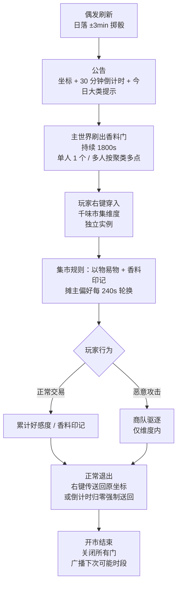

# 千味市集 · 设计文档（Spice Bazaar）

> 面向 NeoForge 1.21.1 的原创"漂移商队"维度玩法。
>
> **状态**：概念设计稿（v0.2，2026-05-17）
> **范围**：从机制、数据、UI 到落地方案的工程蓝图。
> **目标玩法**：主要面向**单人游玩**（含本地存档、单机联机、小型服务器）；多人场景同样受支持，所有触发条件按"在线玩家 ≥ 1"即可成立。
> **依赖原则**：所有偏好物用通用 `#c:` tag + 数据包驱动；具体 mod（如葡萄酒、相机、奥术）作为**可选增强**，缺失时自动降级。
> **命名空间占位**：`<sb>`（落地时替换为 `spice_bazaar`）。

---

## 0. 一句话定位

一个**临时维度**，通过偶发的"香料门"召集玩家进入；门内是一座由 NPC 商队经营的丝绸之路风格集市，**以物易物**为主，配合自有货币"香料印记"作中转，每个摊主有当日偏好；恶意攻击商队会触发驱逐、黑名单与赎罪机制。

设计意图是**给玩家的稀有物品提供一个二级市场**——给探索/魔法/料理玩家一个"我有一堆稀奇物可以兑换什么"的出口。市集自带封闭的"香料印记"经济。

---

## 1. 设计目标

| 编号 | 目标 | 衡量方式 |
|---|---|---|
| G1 | 提供主线货币以外的二级交易渠道 | 单人玩家在 1 次开市内可完成 ≥ 3 次交易；多人时在线玩家参与率 ≥ 50% |
| G2 | 鼓励"囤积冷门物品" | 至少 30% 摊主偏好涉及非主流物品类（农作物、装饰、消耗品） |
| G3 | 制造可重复的偶发事件 | 单人存档下平均每 2–4 个游戏日触发 1 次；公告 30 分钟窗口内玩家进入率 ≥ 60% |
| G4 | 与多个游玩方向（魔法、农业、美食、艺术）的产出形成闭环 | 至少 4 类摊主可共存 |
| G5 | 防止刷取 / 重复进入薅羊毛 | 同一玩家每个开市窗口最多触发 1 次个人化奖励 |

---

## 2. 概念全景



---

## 3. 维度与场景

### 3.1 维度配置

- 维度 ID：`<sb>:bazaar`
- 仅在开市期间动态加载，排除在 Chunky 预生成与 `/forceload` 之外
- 默认渲染：黄昏天光、固定光照、无降雨、无昼夜
- **不允许放置 / 破坏方块**（白名单：椅子、画框、装饰类）
- **不允许 PVP** —— 整个维度 `gamerule pvp false`
- 重力正常
- **飞行/坐骑规则**：默认禁用 Elytra、喷气背包、扫帚等主动飞行手段；地面坐骑（马、骆驼、女仆等）可携带。蓝图中的高低差通过台阶 / 跳跃可达。
- 进入维度时玩家被赋予 10 秒无敌帧 + "客人"状态标记（详见 §4.5）

### 3.2 集市建筑

集市是一组**预生成的结构方块蓝图**，每次开市从池中随机一座地图（首发 3 张）：

| 蓝图代号 | 主题 | 摊位数 | 占地 |
|---|---|---|---|
| `desert_caravan` | 沙漠商队营地 | 12 | 80×80 |
| `silk_road_inn` | 客栈中庭 | 9 | 60×60 |
| `floating_souk` | 浮空神庙集市（以阶梯连通） | 16 | 100×100 |

中心广场固定有：

- **大喷泉**：右键查看本次开市倒计时、当前偏好刷新进度、今日大类提示。
- **商队首领帐篷**：常态不可进入；boss 战触发后开放（见 §4.6）。
- **传送回归石**：右键回到进门时的主世界坐标（若原坐标不安全则降级到该玩家的重生点）。
- **中场互动节点**（见 §4.7）：解决玩家等待轮换时无事可做。

### 3.3 副本模式

默认是独立实例模式，适配单人玩家与小队；多人服可切换共享模式。配置项位于 `<sb>-server.toml`：

| 模式 | 行为 | 适用场景 |
|---|---|---|
| `instanced`（**默认**） | 单人 / 每个 FTB 队伍进入时复制一份独立实例 | 单人存档、小队联机、避免抢摊 |
| `shared` | 服务器内共享一个维度实例 | 强调社交的多人服（人数 ≤ 10 推荐） |

---

## 4. 核心机制

### 4.1 开市刷新

```
触发器：每日游戏内日落（tick 12000 ± 600）一次掷骰。
基础概率：30% 出现。
推迟规则：
  - 若上次开市距今 < 24h，概率 ×0.3
  - 若上次开市距今 > 72h，概率提升至 100%（保底）
  - 在线玩家 ≥ 1 即可触发（单人存档同样适用）
```

**开市窗口**：

- **持续 30 分钟**
- 任一已进入的玩家在最后 5 分钟内可消耗 1 个 `香料印记` **延期 5 分钟**，最多累计延长到 60 分钟
- 时间到后所有门关闭，门内玩家被强制送回

**香料门刷新**：

- **单人 / 单点情况**：在玩家半径 200–400 格内地表生成 1 个门
- **多人情况**：按在线玩家位置聚类，每簇 1 个门，最多 6 个（公式 `N = ceil(在线人数 / 4)`），保证任何玩家半径 300 格内可达
- 必须为地表、非领地、非保护区
- 若任一门 5 次重试均失败，跳过该门并写入日志

**香料门外观**：2×3 的彩色帐幕方块（`<sb>:caravan_curtain`），自带粒子和音效。右键穿入维度。

**"香料契约"补偿**：

- 玩家**首次进入世界次日**自动获得 1 张 `<sb>:caravan_contract`（一次性，强制下次开市出现在身边 50 格内）
- 每周完成任意 3 次集市交易再发 1 张
- 击杀首领亦掉落 1 张，作为高阶奖励
- 单人存档下同样可使用：契约消耗后下一个游戏日落自动触发开市

### 4.2 偏好与好感度

每个摊主有一份 `Stall` 结构：

```json5
{
  "stall_id": "spice_master",
  "display_name": "调味之主 · 阿玛尼",
  "tier": 2,                    // 1-3，决定可掉物品稀有度
  "category": "cuisine",        // cuisine / magic / agriculture / art / arcane / pets
  "unlock_after": "open_count >= 3",  // 阶段解锁，见下文
  "rotation_window_s": 240,     // 每 240 秒换一批偏好
  "wanted_pool": [
    { "tag": "c:wines/aged", "min_age_days": 3, "marks": 10 },
    { "tag": "c:cakes",      "marks": 2 },
    { "tag": "c:cooked_meats", "marks": 1 }
  ],
  "offer_pool": [
    { "tier": "common",  "items": ["..."] },
    { "tier": "rare",    "items": ["..."] },
    { "tier": "epic",    "items": ["..."] }
  ]
}
```

**货币：香料印记（Spice Mark）**

- 交付偏好物 → 获得对应 `marks` 数量印记，**当场进入背包**作为物品 `<sb>:spice_mark`
- 印记可在**任意摊主**消费换"可换回"奖励
- 印记永久保留，上限受 `<sb>:spice_box` 等永久增益影响

**好感度（独立轨）**

- 每个摊主有独立"好感度等级"，影响**该摊主可换回物品的解锁档**
- 来源：交付该摊主**当轮**偏好物 → 累计该摊主的好感度
- 好感度永久保留，等级解锁配合"个人里程碑"互动（见 §4.6）

**摊主阶段解锁**（基于玩家个人进度，单人友好）

| 摊主类别 | 解锁条件 |
|---|---|
| cuisine / agriculture | 玩家首次进入市集即出现 |
| art | 玩家个人累计参与开市 ≥ 3 次 |
| magic / arcane | 玩家个人累计参与开市 ≥ 5 次 |
| pets | 玩家个人完成 ≥ 10 次成功交易 |

每次开市从已解锁类别中随机抽 4–6 个摊主上市。

**物品价值边际递减**：同一物品同轮第 10 个起 `marks` 砍半，第 30 个起再砍半，避免低价物刷分。

### 4.3 交易交互

**摊主是一个不可移动的实体**（自定义 `<sb>:stall_master`），右键打开自定义 GUI：

```
┌──────────────────────────────────────────────┐
│  [摊主头像]  调味之主 · 阿玛尼     [tier ★★]  │
│  好感度：●●●○○  (3/5 至下一级)                │
│  我的香料印记：48                              │
├──────────────────────────────────────────────┤
│  本轮想要（剩余 3:14）                        │
│   ▢ 陈酿酒（3 天以上）   × 1   +10 印记       │
│   ▢ 蛋糕               × 4   +2 印记 / 个     │
│   ▢ 烤肉               × 2   +1 印记 / 个     │
├──────────────────────────────────────────────┤
│  可换回                                       │
│   [神秘香料粉]  消耗 8 印记                   │
│   [传说菜谱·X]  消耗 25 印记（需 ★★★ 好感度） │
│   [稀有种子盲盒] 消耗 12 印记                 │
├──────────────────────────────────────────────┤
│  [ 交付（拖入物品） ]    [ 关闭 ]              │
└──────────────────────────────────────────────┘
```

**误操作保护**：

- 拖入物品后，弹出**二次确认**对话框，明确显示"将交付 X 物品 × N，获得 M 印记"
- 交付后有 **5 秒撤回窗口**：物品仍在摊主"待结算栏"，玩家点"撤回"即取回；5 秒后自动结算并入印记
- 撤回不计入任何负面记录

**其它要点**：

- 提供物按 tag 匹配，忽略附魔/损耗等额外 NBT
- 物品偏好的"陈酿天数"使用通用 `#c:aged` tag 配合 NBT 时间戳；缺该字段的物品按"不限时"处理
- 印记为物品形式，可丢弃，多人时可赠送同队员；出市集自动封印为"个人封印印记"，下次进市集自动展开

### 4.4 摊主分类（首发 6 类）

| 类别 | 想要（tag 驱动） | 给出 |
|---|---|---|
| 美食（cuisine） | `#c:wines/aged`、`#c:teas`、`#c:cakes`、`#c:cooked_meats` | 神秘香料粉、传说菜谱、奖励称号 |
| 农业（agriculture） | `#c:crops`、`#c:seeds`、`#c:fruits/rare` | 稀有种子盲盒、园艺装饰、堆肥催化剂 |
| 艺术（art） | `#c:paintings`、`#c:music_discs`、`#c:photos`（若有） | 染料、画框、稀有唱片 |
| 魔法（magic） | `#c:scrolls`、`#c:arcane_reagents`、`#c:books_enchanted` | 附魔之瓶、经验书残页、强化卷轴 |
| 秘术（arcane） | `#c:occult_reagents`、`#c:soul_items`、`#c:relics` | 召唤合约、雕版残页、特殊药水 |
| 宠物（pets） | `#c:pet_toys`、`#c:pet_food/premium`、`#c:plush` | 限量宠物饰品、染色项圈、可爱皮肤 |

> 任何 mod 可以通过给自家物品打这些 tag 来"加入市集"。
> 服主可在 `config/<sb>/wanted_pools.json` 自定义本服偏好物。

### 4.5 商队规则与驱逐

**触发条件**：

- **持续攻击摊主**：5 秒内累计 3 次 + 任一造成伤害
- **绕过 GUI 抢回交付物品**：5 秒撤回窗口结束后用 `/give` 等手段取回已结算物品（基本仅外挂可触发）

掉落物 5 秒后自动飞回原主。维度内方块破坏由客户端阻止。

**惩罚梯度**：

| 累计 | 处理 |
|---|---|
| 1 次 | 摊主对该玩家关闭 GUI 60 秒（黄字提示"请保持礼节"） |
| 2 次 | 该玩家本轮所有摊主拒绝交易；印记和好感度保留 |
| 3 次 | 触发**仅维度内**的商队驱逐：3 名 `<sb>:caravan_guard` 把玩家护送出维度 |
| 5 次 | 该玩家进入"客人黑名单"，后续 3 次开市内 NPC 拒绝交易 |

**赎罪机制**：

- 黑名单期间可在中心广场的"赎罪台"完成任意 3 个小任务（送水、修补帐篷、献歌）即可解除
- 也可用 1 个香料印记直接抵消 1 次记录（高代价但即时）

**caravan_guard 行为**：

- HP 60、攻击 8、维度内近战护送
- 玩家走到维度出口或被强制送回后自动消散
- 仅在 boss 战场景下掉落物品

### 4.6 商队首领（Boss）

**触发**（个人进度驱动，单人存档也可完整经历）：

1. **善意路径**（主路径）：玩家在任一摊主好感度达到 ★★★ 满级，下次开市该摊主主动向玩家发出"挑战首领"邀请（玩家选择接受）
2. **里程碑路径**：玩家个人累计参与开市达到 25 / 50 / 100 次时，自动开放一次首领出场
3. **赎罪路径**：曾被黑名单且已赎罪的玩家，可消耗 5 印记挑战首领
4. **失格路径**：偷窃累计达 7 次的玩家进入开市直接召唤首领

- ID：`<sb>:caravan_master_zaher`
- HP 600 / 攻击 22 / 移速 0.32
- 三阶段：
  1. **盘问相位**：挥短弯刀，每 4 秒掷出 3 把回旋飞刀。低伤但击退强。
  2. **请罪相位**（HP < 60%）：召唤 4 名 caravan_guard，自己进入护盾。必须先杀光护卫。
  3. **决断相位**（HP < 25%）：踏上地面骆驼坐骑，范围突进，地表残留沙尘 DOT。
- **击杀奖励**：
  - 100% 掉落 1 张"商队契约"（强制下次开市出现在身边）
  - 25% 掉落"驯化骆驼鞍"：地面骑乘，骆驼有 2 格背包
  - 5% 掉落"首领的香料盒"：永久 +20 香料印记上限
- 击杀后清空该玩家所有偷窃 / 黑名单记录
- 个人冷却 14 天，避免速通刷宝

### 4.7 中场互动

中心广场和摊位之间散布以下互动点，供玩家在 240 秒摊主轮换间隙参与：

| 互动 | 描述 | 奖励 |
|---|---|---|
| **掷骰桌** | 押 1 印记猜大小，赢得 2 印记，连胜衰减 | 小额印记，社交气氛 |
| **品酒猜年份** | 摊主出题，猜中陈酿年份 | 1–3 印记 + 该摊主好感度 +1 |
| **驼铃收集** | 集市各处藏 12 枚驼铃，每次开市重置；集齐 5 枚换 1 印记 | 探索奖励 |
| **故事帐篷** | NPC 讲商队历史，听完触发"已知"成就 | Patchouli 章节解锁 |
| **赎罪台** | 黑名单玩家完成任务 | 解除黑名单 |

所有互动仅消耗印记或免费，使用主线背包外的独立资源。

---

## 5. 物品清单

### 5.1 招牌物品

| ID | 类别 | 功能 |
|---|---|---|
| `<sb>:caravan_curtain` | 方块（仅生成） | 香料门 |
| `<sb>:spice_mark` | 货币物品 | 市集内通用印记；出市集自动封印 |
| `<sb>:spice_powder_*` | 消耗品 × 5 色 | 撒在食物上变随机增益 buff 食物 |
| `<sb>:legendary_recipe` | 消耗品 | 解锁一个仅此处可得的料理配方（datapack 注入） |
| `<sb>:rare_seed_box` | 盲盒 | 开出随机罕见种子（基于通用 `#c:seeds/rare` tag） |
| `<sb>:caravan_contract` | 一次性道具 | 强制下次开市出现在自己 50 格内 |
| `<sb>:tame_camel_saddle` | 装备 | 地面骑乘骆驼，骆驼有 2 格背包 |
| `<sb>:spice_box` | 永久增益 | +20 印记上限 |
| `<sb>:silk_scroll` | 装饰 | 装饰画类，可挂墙 |
| `<sb>:caravan_token` | 道具 | 击杀首领或赎罪任务掉落，可抵消 1 次偷窃记录 |

> 服主可在 datapack 中给 `<sb>:spice_mark` 加自定义合成（如 16 印记 = 1 绿宝石）来对接本服货币。

### 5.2 偏好物白名单（数据驱动）

`config/<sb>/wanted_pools.json` —— 一张大表，按摊主分类组织，**全部基于通用 tag**。

**首发条目**（节选）：

```json5
{
  "cuisine": [
    { "tag": "c:wines/aged",   "min_age_days": 3, "marks": 10 },
    { "tag": "c:jams",         "marks": 3 },
    { "tag": "c:teas",         "marks": 4 },
    { "tag": "c:cakes",        "marks": 2 }
  ],
  "magic": [
    { "tag": "c:scrolls",          "marks": 6 },
    { "tag": "c:books_enchanted",  "marks": 8 },
    { "tag": "c:arcane_reagents",  "marks": 5 }
  ],
  "art": [
    { "tag": "c:paintings",  "marks": 4 },
    { "tag": "c:music_discs", "marks": 6 }
  ]
}
```

任何 mod 只要给自家物品打上对应 `#c:` tag 即可"加入市集"，无需 spice-bazaar 显式适配。

---

## 6. 与其他模组的集成

所有 mod 集成均为软依赖，通过 tag 自动识别，缺失时该类别自动降级。

### 6.1 集成方式（统一）

- **通过 tag 自动识别**：mod 物品贴 `#c:` tag → 自动进入对应偏好池
- **通过 datapack 注入**：服主可在 `config/<sb>/integrations/` 下放置 mod 专属补丁
- **核心 jar 编译期零外部 mod 依赖**

### 6.2 推荐打 tag 的 mod（示例）

| Mod 类型 | 示例 mod | 建议 tag |
|---|---|---|
| 葡萄酒 / 茶饮 | Vinery、Brewery、Let's Do | `#c:wines/aged`、`#c:teas` |
| 料理 | Chef's Delight、Bakery、Farmer's Delight | `#c:cakes`、`#c:jams`、`#c:cooked_meats` |
| 农业 | Farm Charm、Bumblezone | `#c:crops`、`#c:seeds/rare` |
| 摄影 / 艺术 | Exposure | `#c:photos` |
| 法术 / 魔法 | 任意 | `#c:scrolls`、`#c:arcane_reagents` |
| 秘术 | 任意 | `#c:occult_reagents`、`#c:relics` |
| NPC / 宠物 | 任意 | `#c:pet_toys`、`#c:plush` |
| 团队（可选） | FTB Teams | 多人时好感度按个人记录，团队最高值共享解锁档；单人玩家无影响 |
| 传送点 | Waystones | 禁止在市集内放置碑 |

### 6.3 与主存档 / 服务器经济的关系

- `<sb>:spice_mark` 出市集后强制封印，限制于市集内消费
- 击杀首领的奖励价值由配方/玩法决定，与主线货币系统独立
- 偷窃记录持久化到 `world/<sb>/player_records.json`（单人为存档本地，多人为服务端共享统计）

---

## 7. 实现路径

### 7.1 推荐落地形态

**1.0 阶段（KubeJS + Datapack + 现有结构方块）**

- 开市调度、香料门刷新、维度入口走 KubeJS 计时器 + `Dimension.fromName()`
- 商人实体复用 `minecraft:villager` 子类，靠 KubeJS 的 `EntityEvents.attributes` 改 AI 标签
- GUI 用 `ftb-library` 的 `GuiHelper`，或直接借 ChestGUI 兼容性最好
- 蓝图导入 Structurize（已在包内），用 `/structurize place` 命令脚本化
- caravan_guard 走 `minecraft:vindicator` 子类，AI 仅限维度内

**预估工作量**：1 名工程 × 2–3 周。

**2.0 阶段（独立 NeoForge mod）**

- 引入自定义维度生成器、自定义实体类型
- 自定义 GUI、AI Goal、商队首领行为树
- 引入 Patchouli 章节作为攻略入口

**预估工作量**：1 名工程 × 6–8 周。

### 7.2 关键 KubeJS 钩子（1.0 阶段）

```js
// 开市调度
ServerEvents.tick(event => {
  if (event.server.overworld().dayTime % 24000 === 12000) {
    tryOpenBazaar(event.server)
  }
})

// 仅在持续攻击摊主时累计偷窃
EntityEvents.hurt(event => {
  if (event.entity.type === '<sb>:stall_master' && event.source.actual.player) {
    recordAttackAttempt(event.source.actual, event.entity)
    // recordAttackAttempt 内部判断 5 秒窗口内是否 ≥ 3 次
  }
})

// 维度内退出自动撤回 guard
PlayerEvents.dimensionChanged(event => {
  if (event.from.id === '<sb>:bazaar') {
    despawnGuardsFor(event.player)
  }
})
```

### 7.3 数据存储

| 路径 | 内容 | 持久化 |
|---|---|---|
| `world/<sb>/state.json` | 上次开市时间、地图序列号、当前实例 | 是 |
| `world/<sb>/player_records.json` | 印记上限、好感度、偷窃次数、黑名单计数 | 是 |
| `config/<sb>/wanted_pools.json` | 偏好物配置 | 否（只读） |
| `config/<sb>/stalls.json` | 摊主定义 | 否（只读） |
| `config/<sb>/blueprints.toml` | 蓝图池 + 权重 | 否（只读） |

---

## 8. 平衡性与防滥用

| 风险 | 缓解 |
|---|---|
| 单人速通 / 多人组团刷 boss | 个人 14 天冷却；boss 掉落"首领密信"按击杀者均分 |
| 高产玩家用大量低价物刷分 | 印记上限 + 物品 `marks` 边际递减（同一物品同轮第 10 个起 marks /2，第 30 起再 /2） |
| 偏好物倾向单一 mod | 配置文件强制每类至少 3 个 tag 来源，且每类核心 tag 至少 1 个来自原版 |
| 玩家长期离线 / 单人下线错过开市 | 商队契约**首次进入次日**即发 1 张；每周完成 3 次交易再发 1 张；单人玩家退出存档时暂停开市计时 |
| 偷窃后退服规避 | 偷窃记录持久化，重连后保留累计计数 |
| 管理员 / 单人作弊滥用维度 | `<sb>.admin.force_open`、`<sb>.admin.close` 命令多人需 LuckPerms 节点；单人通过开服 toml 显式开启 |
| 印记带出存档 / 跨服倒卖 | 出市集自动封印，下次进市集自动展开 |
| 共享副本下抢摊 | 默认 `instanced`（单人即一份实例），shared 仅多人小服可选 |

---

## 9. 风险与待研究

1. **维度内实体 AI 与 Structurize 蓝图碰撞**——蓝图建筑物中摊主 spawn 点偶发被障碍物挤出，需测试。
2. **`<sb>:spice_mark` 物品形态 vs 数据形态**——首选物品形态以便队友赠送，需测试背包整理 mod 是否会自动合并/分裂导致状态错乱。备用方案：玩家 NBT 数据形态 + 队友赠送指令。
3. **首领骆驼坐骑**——纯地面运动行为树。
4. **多语言**——首发简中 + 英文，文案表用 `kubejs/assets/<sb>/lang/`。

---

## 10. 验收标准（首发）

- [ ] **单人存档**：从新建世界开始，10 个游戏日内至少触发 1 次开市，全链路（穿入 → 交易 → 退出）可走通
- [ ] **多人服务器**：10 次连续模拟开市无崩溃
- [ ] 至少 3 张集市蓝图、6 个摊主分类、每类 ≥ 3 个偏好物
- [ ] 偷窃 → 维度内驱逐 → 黑名单 → 赎罪 → 解除，全链路可走通
- [ ] caravan_master 三阶段行为树正确触发，善意路径与失格路径均可召唤
- [ ] 印记、好感度、黑名单计数的跨重启持久化
- [ ] 二次确认 + 5 秒撤回 UI 行为正确
- [ ] instanced 默认模式下单人独占实例 + 多人并发提交无状态错乱
- [ ] 配置文件热加载（`/<sb> reload`）
- [ ] Spark profiling：开市开启时服务器 mspt < 50
- [ ] 首次进入次日自动收到香料契约
- [ ] 中场互动（掷骰、品酒、驼铃）≥ 3 种可玩

---

## 11. 后续可拓展点

- **节令限定摊主**（接 #10 节令系统）：春分卖樱花种子、冬至卖暖酒
- **故事帐篷扩写**：商队首领背景、各摊主小剧情，逐次开市解锁
- **商队首领可驯化分支**：5% 概率战后投降并跟随玩家
- **集市内迷你赛事**：限时寻宝、香料调配大赛，奖印记
- **跨服商队**（远期）：多服务器开市同步，**印记跨服可流通**（需 Velocity 代理 + 中央账户）
